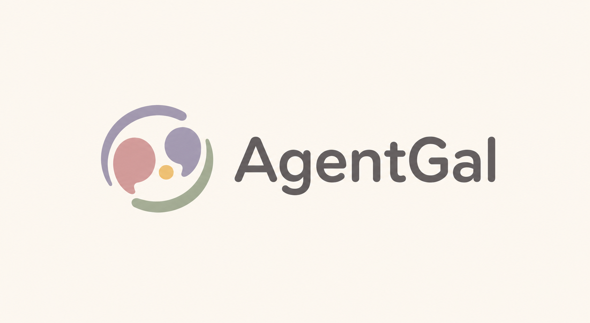

# AgentGal

<p align="center">
  
</p>

AgentGal 是一个开放世界多 Agent 角色扮演 / 叙事游戏系统。

玩家和角色生活在同一个会持续变化的游戏世界里。你可以自由行动、主动找人、离开当前场景、跳过时间、改变关系走向；角色会根据自己的性格、目标和已经经历过的事情作出回应。

AgentGal 最核心的目标是：**每次游玩都生成一条不一样的故事线**。即使是同一个角色，也会因为遇到的玩家不同、经历的事件不同、被对待的方式不同，慢慢展现出不一样的面貌。

## 项目特点

### 主要特点

**开放世界式推进**

玩家不需要沿着固定剧情树走。你可以在当前场景里继续对话，也可以转身离开、给别人发消息、去另一个地点、等待到晚上、临时改变计划。系统会根据当前世界状态接住这些行动，并把故事推进到新的场景。

开放世界在这里指叙事自由度：玩家的行动可以改变谁在场、谁知道了什么、下一幕发生在哪里，以及角色之后会不会主动来找你。

**自主生成角色**

故事可以从初始模板继续扩展。当剧情需要出现新的长期人物时，系统会生成新的角色，并给他/她建立姓名、身份、目标、说话方式、当前状态、关系视角和日常行动轨迹。

进入主要关系网络的新角色会继续参与后续剧情，拥有自己的记忆和变化。

**经历会改变角色**

角色不会只停留在初始人设里。一次冲突、一次承诺、一句被记住的话、一次没有赴约，都会进入角色之后的判断。

同一个角色在不同世界线里可能变得更信任你、更疏远你、更依赖你，也可能因为某些经历改变对其他角色的看法。角色的“感觉”来自一路发生过的事情，并持续越过开局设定。

**角色有独立视角**

每个角色都有自己的记忆和判断。角色知道的事情取决于他/她是否在场、是否收到了消息、是否被别人告知。某个角色背后发生的事，不会自动同步给所有人。

这种信息差会自然制造误会、秘密、试探和补救空间。玩家可以选择坦白、隐瞒、拖延、解释，也可以利用角色之间知道的信息不同来推动剧情。

**关系网络会自己长出来**

主要角色之间也会形成印象、比较、信任、嫉妒、合作或回避。玩家的选择会影响这些关系，角色之间的关系也会反过来影响玩家的处境。

当故事推进得足够久，世界会从“几个角色和玩家聊天”变成一张逐渐复杂的人际网络。

**适合慢热游玩**

AgentGal 更适合把角色当作会长期相处的人来玩。短期内可以看见角色回应差异，长期游玩时更能看到记忆、关系和人格变化带来的细微差别。

## 如何使用

### 1. 本地启动

安装依赖：

```bash
uv sync
```

复制环境变量模板：

```bash
cp .env.example .env
```

打开 `.env`，填入模型服务配置。最少需要：

```bash
LLM_API_URL=your-llm-api-url
LLM_API_KEY=your-llm-api-key
LLM_MODEL_ID=deepseek-v4-pro # 建议使用 deepseek 模型，在角色扮演上表现好。如果你有其他模型也可以使用。
```

如果使用其他 OpenAI-compatible 模型服务，按 `.env.example` 里的注释调整 URL 和模型名。

启动：

```bash
uv run uvicorn server:app
```

然后打开：

```text
http://localhost:8000
```

### 2. 开始游玩

进入页面后选择一个故事模板：

- `school`：校园故事，初始单女主为美月。
- `modern`：现代都市故事，初始双女主为陈晓和顾以宁。

建议先从 `school` 开始。单女主开局更容易观察同一个角色如何被经历慢慢改变。

选择故事后，直接在输入框里说话或描述行动即可。

你可以输入台词：

```text
“你今天看起来有点累，要不要一起去天台吹会儿风？”
```

也用括号表示动作：

```text
（把手机扣在桌上，假装没看到那条消息）
```

也可以主动改变场景：

```text
（去找美月）
```

或者跳过时间：

```text
（等到晚上十点，给陈晓发消息）
```

### 3. 和角色互动

每轮角色回应后，页面会在后台生成几个可选行动；选项还没出现时也可以直接输入。你可以点击选项继续，也可以自己输入完全不同的内容。

角色创建后，输入区会出现「旁观」开关。开启后可以输入想观察的角色名，系统会布置一个没有玩家入场的场景，让在场角色自然互动；旁观轮不会生成玩家行动选项。

如果想推动开放世界体验，可以多尝试：

- 指定想找谁。
- 说明自己要去哪里。
- 明确是当面说、发消息、打电话，还是只在心里想。
- 让角色之间产生交集，例如邀请两个人同时出现。
- 做一些会留下后果的选择，例如失约、隐瞒、道歉、承诺、公开关系。

这些行为会影响角色知道什么、记住什么，以及之后如何对待你。

### 4. 生成新角色

当故事需要新角色时，系统会自动生成。

例如：

```text
你之前说的那个社团前辈，今天也会来吗？
```

如果这个人物适合进入主要关系网，系统会自动创建角色，并让他/她在后续剧情中继续存在。

### 5. 存档、读档和重开

页面提供统一的档案抽屉和世界线页面，用不可变节点管理存档、读档和重开。

- **新建存档**：生成一个新的世界线节点。若当前进度来自旧存档，新节点会挂在旧节点下方。
- **世界线**：按故事世界观分 tab 展示存档树，能看到同一分支和从哪个节点开始分叉。
- **读取**：恢复过去的世界线节点。之后继续保存，会从该节点分出新分支。
- **删除**：可以删除整个 Game，也可以单独删除没有子分支的叶子存档节点。
- **重开**：清空当前进度，从故事模板重新开始。

建议在关键关系节点前存档，例如表白、摊牌、分别、冲突升级、引入新角色之前。

### 6. 回看历史

页面顶部的搜索按钮可以展开历史搜索框，搜索消息内容并跳到匹配回合；历史按钮仍可按游戏内日期跳回旧回合。长线游玩时，可以用它找回早先的约定、误会或角色提到过的细节。

### 7. 推荐玩法

- 把输入框当成“台词 + 行动 + 意图”的混合输入。
- 不必每次都解释完整背景，角色会根据已经发生过的事理解你。
- 想制造信息差时，明确说明谁在场、谁没听见、消息发给了谁。
- 想让关系推进时，给角色留下可回应的情绪或选择。
- 想看角色变化时，不要频繁重开；让同一条世界线多走一段。
